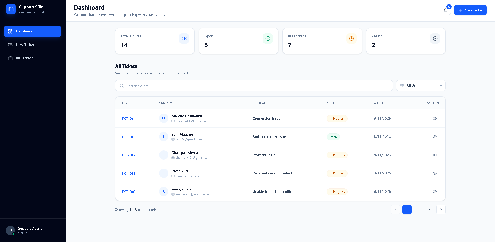
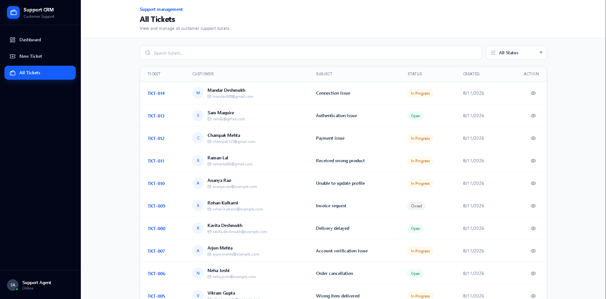
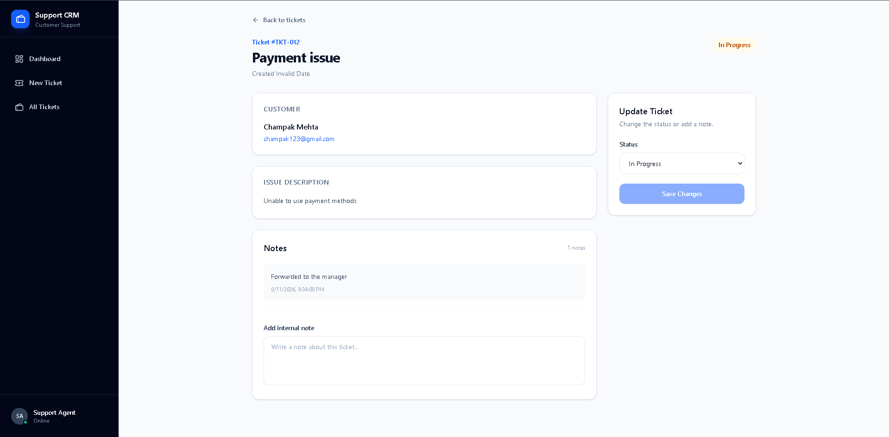
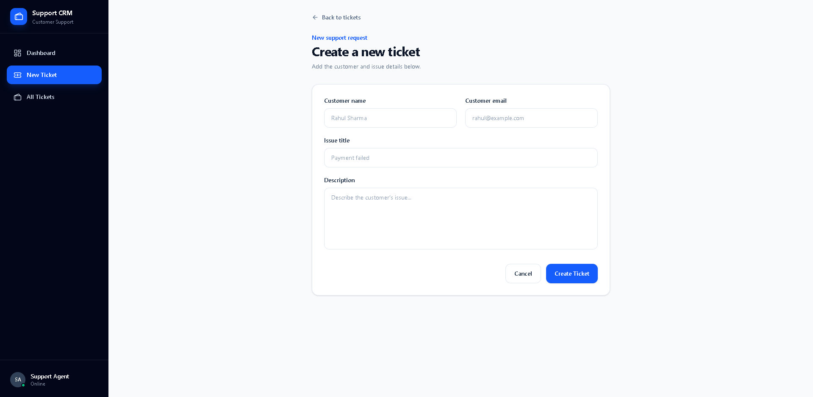

# 🎫 Support CRM

A modern full-stack customer support ticket management system for creating, tracking, searching, and managing customer support requests.

## ✨ Features

- 🎫 Create and manage support tickets
- 🔢 Automatic ticket ID generation
- 🔍 Search by ticket ID, customer name, email or subject
- 🏷️ Filter tickets by status
- 📊 Dashboard statistics for Total, Open, In Progress, and Closed tickets
- 📝 Add notes and comments to tickets
- 🔄 Update ticket status
- 🔔 Recent active-ticket notifications
- 📄 Paginated ticket listing
- 📱 Responsive desktop and mobile interface
- 🔔 Toast notifications for success and error feedback
- ⚡ Clean REST API architecture

## 🖥️ Screenshots

### Dashboard



### All Tickets



### Ticket Details



### New Ticket 



## 🛠️ Tech Stack

### Frontend

<p>
  
  
  
  
  
</p>

- React.js
- Vite
- React Router
- Tailwind CSS
- Axios
- Lucide React
- React Hot Toast

### Backend

<p>
  
  
  
</p>

- Node.js
- Express.js
- MongoDB Atlas
- Mongoose
- dotenv

### Deployment

- Vercel — Frontend
- Render — Backend
- MongoDB Atlas — Database

## 📁 Project Structure

```text
support-CRM/
│
├── frontend/
│   ├── public/
│   └── src/
│       ├── assets/
│       ├── components/
│       │   ├── DashboardHeader.jsx
│       │   ├── Layout.jsx
│       │   ├── MobileHeader.jsx
│       │   ├── Navbar.jsx
│       │   ├── NotificationsDropdown.jsx
│       │   ├── SearchAndFilter.jsx
│       │   ├── Sidebar.jsx
│       │   ├── StatsCard.jsx
│       │   ├── StatusFilter.jsx
│       │   └── TicketTable.jsx
│       ├── pages/
│       │   ├── AllTickets.jsx
│       │   ├── CreateTicket.jsx
│       │   ├── Dashboard.jsx
│       │   └── TicketDetails.jsx
│       ├── services/
│       │   └── ticketService.js
│       ├── App.jsx
│       ├── App.css
│       ├── index.css
│       └── main.jsx
│
├── backend/
│   └── src/
│       ├── config/
│       │   └── db.config.js
│       ├── controllers/
│       │   └── ticket.controller.js
│       ├── models/
│       │   ├── note.model.js
│       │   └── ticket.model.js
│       ├── routes/
│       │   └── ticket.route.js
│       ├── seeds/
│       │   └── tickets.seed.js
│       ├── app.js
│       └── server.js
│
└── README.md
```

## 🔌 API

| Method | Endpoint | Description |
|---|---|---|
| `POST` | `/api/tickets` | Create a new ticket |
| `GET` | `/api/tickets` | Get tickets with search/filter support |
| `GET` | `/api/tickets/:ticketId` | Get ticket details |
| `PUT` | `/api/tickets/:ticketId` | Update ticket status and notes |

### Search & Filtering

```text
GET /api/tickets?search=rahul
GET /api/tickets?status=Open
GET /api/tickets?search=payment&status=Open
```

Search supports ticket ID, customer name, customer email, subject, and description.

## ⚙️ Getting Started

### 1. Clone the repository

```bash
git clone https://github.com/sarveshmondkar/support-CRM.git
cd support-CRM
```

### 2. Setup Backend

```bash
cd backend
npm install
```

Create a `.env` file:

```env
PORT=5000
MONGODB_URI=your_mongodb_connection_string
```

Start the backend:

```bash
npm run dev
```

### 3. Setup Frontend

```bash
cd frontend
npm install
```

Create a `.env` file:

```env
VITE_API_URL=your_backend_url
```

Start the frontend:

```bash
npm run dev
```

## 🌱 Seed Data

To populate the database with sample tickets:

```bash
cd backend
npm run seed:db
```

## 🏗️ Architecture

```text
                 ┌──────────────────┐
                 │   React Frontend │
                 │   Vite + Tailwind│
                 └────────┬─────────┘
                          │
                          │ REST API
                          ▼
                 ┌──────────────────┐
                 │ Express Backend  │
                 │     Node.js      │
                 └────────┬─────────┘
                          │
                       Mongoose
                          │
                          ▼
                 ┌──────────────────┐
                 │  MongoDB Atlas   │
                 └──────────────────┘
```

## 📊 Dashboard

The dashboard provides an overview of the support workload:

- Total Tickets
- Open Tickets
- In Progress Tickets
- Closed Tickets

It also provides ticket search, status filtering, pagination, and quick access to ticket details.

## 🔮 Future Improvements

- Authentication and role-based access control
- Ticket assignment to support agents
- Ticket priority and SLA tracking
- Customer profiles
- Email notifications
- File attachments
- Ticket activity and audit history
- Real-time ticket updates

## 👨‍💻 Author

**Sarvesh Mondkar**

[GitHub](https://github.com/sarveshmondkar)

---

⭐ If you find this project useful, consider giving it a star.
